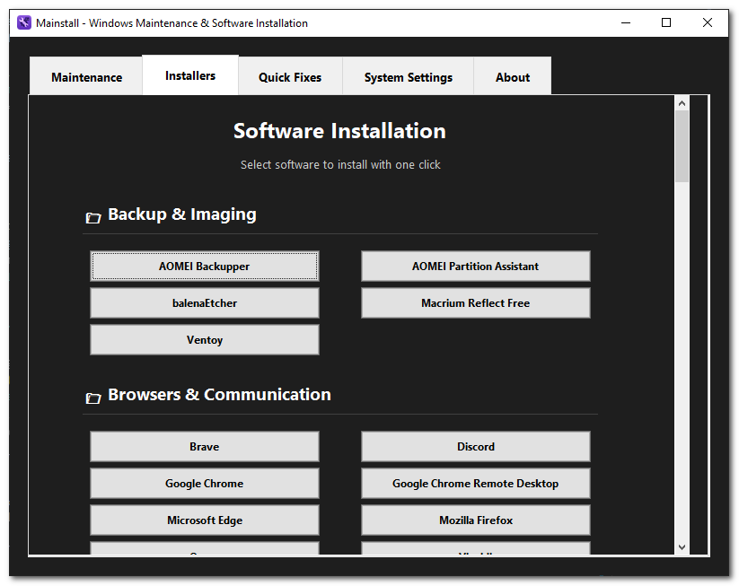

# Mainstall

A professional-grade Windows desktop application for system maintenance and software installation. Mainstall provides an intuitive GUI interface for common Windows maintenance tasks and software installation using winget.

## Features

### 🔐 Administrator Privileges
- Automatically requests and validates administrator privileges on startup
- Uses UAC (User Account Control) for secure elevation
- All PowerShell commands inherit elevated permissions

### 🖼 Modern Dark Theme GUI
- Clean, professional dark theme interface with high contrast
- Two-tab layout: Maintenance and Installers
- Fixed-size window (800x600) with proper centering
- Scrollable content areas with mouse wheel support
- Custom application icon with proper Windows integration

### 🛠 Maintenance Tab
- **Winget Upgrade All**: Update all installed packages
- **SFC Scan**: System File Checker for Windows integrity
- **DISM Commands**: ScanHealth, CheckHealth, and RestoreHealth
- **Check Disk**: Disk integrity check for C: drive
- **Deep Disk Cleanup**: Comprehensive cleanup including DISM, Disk Cleanup, and temp files
- **Run All Maintenance**: Execute all maintenance tasks in sequence

### 📦 Installers Tab (80+ Software Options)

#### Development Tools
- Atom, Docker Desktop, Git for Windows, Node.js, Postman, Python, Sublime Text, Visual Studio Code, WinMerge

#### File Management
- 7-Zip, Everything, FileZilla, FreeFileSync, Rufus, TeraCopy, WinRAR, WinSCP

#### Gaming & Entertainment
- Battle.net, Epic Games Launcher, GOG Galaxy, Origin, Steam, Ubisoft Connect

#### Graphics & Media
- Audacity, Blender, DaVinci Resolve, GIMP, HandBrake, Inkscape, IrfanView, K-Lite Codec Pack, Krita, Lightworks, OBS Studio, Paint.NET, SketchUp, VLC Media Player

#### Network & Remote Access
- Advanced IP Scanner, Angry IP Scanner, AnyDesk, Fiddler, LocalSend, NetWorx, nmap, OpenVPN, ProtonVPN, PuTTY, Speedtest by Ookla, TeamViewer, Wireshark

#### Office & Productivity
- Adobe Acrobat Reader, AutoHotkey, Calibre, Greenshot, KeePass, LibreOffice, Microsoft PowerToys, Notepad++, Obsidian, ShareX, Sumatra PDF, Trello, Typora

#### Security
- Avast Free Antivirus, AVG AntiVirus Free, Bitdefender Free, Bitwarden, CCleaner, DefenderUI, GlassWire, Malwarebytes, Spybot Search & Destroy, VeraCrypt, Windows Defender Exclusions Manager, Windows Firewall Control

#### System Monitoring & Diagnostics
- AIDA64, Autoruns, CrystalDiskInfo, CPU-Z, FurMark, HWiNFO, MemTest86, Prime95, Process Explorer, Process Hacker, Process Monitor, Revo Registry Cleaner, Revo Uninstaller, TCPView, WinDirStat

## Screenshots

### Maintenance Tab


### Installers Tab


## Tabs

### Maintenance
- Run system maintenance and repair commands (SFC, DISM, chkdsk, etc.)
- Each action opens a PowerShell window for transparency
- Confirmation required before any maintenance task runs

### Installers
- Install popular software with a single click
- Categories: Browsers, Development, File Management, Gaming, Graphics, Network, Office, Security, System Utilities
- Uses winget for silent, official installs
- Tooltips provide detailed info for each app

### About
- Version: Beta 1.0.0.0
- Author: Caveman
- License: MIT
- Support/updates link

## Requirements

- Windows 10/11
- Python 3.7 or higher (for development)
- Administrator privileges (automatically requested)

## Installation

### Option 1: Run from Source

1. Clone or download this repository
2. Install Python dependencies (none required - uses standard library)
3. Run the application:
   ```bash
   python mainstall.py
   ```

### Option 2: Build Executable (Recommended)

#### Quick Build
1. Run the PowerShell build script:
   ```powershell
   .\build.ps1
   ```

#### Manual Build
1. Install PyInstaller:
   ```bash
   pip install pyinstaller
   ```

2. Build the executable:
   ```bash
   pyinstaller mainstall.spec
   ```

3. The executable will be created in the `dist/` folder

### Option 3: Run Existing Executable

1. Download the latest release
2. Extract the ZIP file
3. Run `Mainstall.exe` (will request admin privileges)

## Usage

### Starting the Application
1. Run `mainstall.py`, `Mainstall.exe`, or use `run_mainstall.bat`
2. The application will automatically request administrator privileges
3. Accept the UAC prompt to continue

### Maintenance Operations
1. Click on the "Maintenance" tab
2. Choose individual maintenance tasks or use "Run All Maintenance"
3. Each command opens in a separate PowerShell window for visibility
4. Commands execute with `-NoExit` flag to keep windows open

### Software Installation
1. Click on the "Installers" tab
2. Browse categories or use the search functionality
3. Hover over buttons for detailed tooltips
4. Select the software you want to install
5. Confirm the installation prompt
6. Installation runs silently in the background via winget

## Build Information

### Executable Details
- **File**: `dist/Mainstall.exe`
- **Size**: ~10MB
- **Icon**: Custom icon with multiple resolutions
- **UAC**: Requests administrator privileges
- **Console**: No console window (GUI only)

### Build Scripts
- `build.ps1`: PowerShell build script with error handling
- `run_mainstall.bat`: Batch file to launch the executable
- `mainstall.spec`: PyInstaller configuration file

## Command Details

### Maintenance Commands
- `winget upgrade --all`: Updates all winget packages
- `sfc /scannow`: System File Checker scan
- `DISM /Online /Cleanup-Image /ScanHealth`: DISM health scan
- `DISM /Online /Cleanup-Image /CheckHealth`: DISM health check
- `DISM /Online /Cleanup-Image /RestoreHealth`: DISM health restoration
- `chkdsk C:`: Disk integrity check

### Deep Disk Cleanup
- `Dism.exe /Online /Cleanup-Image /StartComponentCleanup /ResetBase`
- `cleanmgr /verylowdisk /d C:`
- `Remove-Item "$env:TEMP\*" -Recurse -Force -ErrorAction SilentlyContinue`

### Software Installation
All software installations use: `winget install -e --id <APP_ID> --silent`

## Development

### Project Structure
```
Mainstall/
├── mainstall.py          # Main application file
├── mainstall.spec        # PyInstaller specification
├── build.ps1             # PowerShell build script
├── run_mainstall.bat     # Batch launcher
├── requirements.txt      # Dependencies (minimal)
├── assets/
│   ├── Mainstall_Image.png  # Source icon
│   └── mainstall.ico        # Windows icon
├── dist/
│   └── Mainstall.exe        # Built executable
├── README.md            # This file
└── LICENSE              # MIT License
```

### Code Features
- Well-commented, clean Python code
- Type hints for better code clarity
- Error handling and user feedback
- Modular design with separate methods for each functionality
- Professional GUI with dark theme
- Comprehensive tooltip system
- Smart tooltip positioning
- Universal mouse wheel scrolling

### Customization
- Add new maintenance commands in the `maintenance_buttons` list
- Add new software in the `software_categories` dictionary with appropriate winget IDs
- Modify the dark theme colors in the `setup_styles()` method
- Adjust window size and layout as needed
- Customize tooltips in the `software_tooltips` dictionary

## Troubleshooting

### Common Issues

1. **UAC Prompt Not Appearing**
   - Ensure you're running the application as intended
   - Check Windows security settings

2. **Commands Not Executing**
   - Verify administrator privileges
   - Check if PowerShell execution policy allows script execution
   - Ensure winget is installed and accessible

3. **GUI Not Displaying Properly**
   - Verify Python and tkinter are properly installed
   - Check display scaling settings on high-DPI displays

4. **Build Failures**
   - Ensure PyInstaller is installed: `pip install pyinstaller`
   - Check that all required files exist
   - Run the build script: `.\build.ps1`

### PowerShell Execution Policy
If you encounter execution policy issues, run PowerShell as Administrator and execute:
```powershell
Set-ExecutionPolicy -ExecutionPolicy RemoteSigned -Scope CurrentUser
```

## Security Considerations

- The application requires administrator privileges for system maintenance
- All commands are executed in separate PowerShell windows for transparency
- No commands are executed silently without user confirmation
- Software installations use official winget packages
- Input validation and command sanitization implemented
- Security checks prevent command injection

## License

This project is licensed under the MIT License - see the LICENSE file for details.

## Contributing

1. Fork the repository
2. Create a feature branch
3. Make your changes
4. Test thoroughly
5. Submit a pull request

## Support

For issues, feature requests, or questions:
1. Check the troubleshooting section
2. Review the code comments
3. Create an issue in the repository

## Support & Feedback

If you find any bugs, issues, or have suggestions, **please don't hesitate to submit a ticket or open an issue on the project's GitHub page.**

Your feedback helps make Mainstall better for everyone!

---

**Note:** This application performs system-level operations. Always ensure you have backups before running maintenance operations, and understand the implications of each command before execution. 