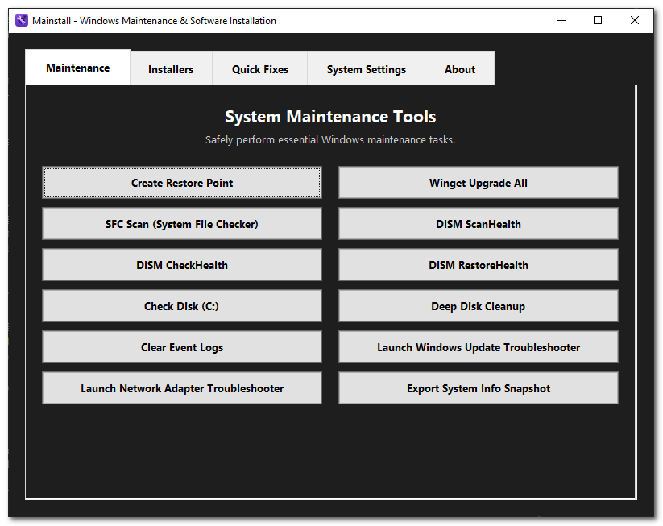

# Mainstall

A professional-grade Windows desktop application for system maintenance and software installation. Mainstall provides an intuitive GUI interface for common Windows maintenance tasks and software installation using winget.

## ⚠️ Important Disclaimer

**This application requires administrator privileges and performs system-level operations. Use at your own risk.**

- **System Changes**: This application executes commands that modify your Windows system, including file system operations, registry changes, and software installations.
- **Administrator Access**: The application requires and requests administrator privileges to function properly.
- **No Warranty**: This software is provided "as is" without any warranty. The authors are not responsible for any damage to your system.
- **Backup Recommendation**: It is strongly recommended to create a system restore point or backup before using maintenance features.
- **User Responsibility**: Users are responsible for understanding the commands being executed and their potential impact on their system.
- **Testing**: Test the application in a safe environment before using it on production systems.

By using this application, you acknowledge that you understand these risks and accept responsibility for any consequences.

## Features

### 🔐 Administrator Privileges
- Automatically requests and validates administrator privileges on startup
- Uses UAC (User Account Control) for secure elevation
- All PowerShell commands inherit elevated permissions

### 🖼 Modern Dark Theme GUI
- Clean, professional dark theme interface with high contrast
- Two-tab layout: Maintenance and Installers
- Fixed-size window (800x600) with proper centering
- Scrollable content areas with mouse wheel support
- Custom application icon with proper Windows integration

### 🛠 Maintenance Tab
- **Create Restore Point**: Create a Windows System Restore Point before making changes
- **Winget Upgrade All**: Update all installed packages
- **SFC Scan**: System File Checker for Windows integrity
- **DISM Commands**: ScanHealth, CheckHealth, and RestoreHealth
- **Check Disk**: Disk integrity check for C: drive
- **Deep Disk Cleanup**: Comprehensive cleanup including DISM, Disk Cleanup, and temp files

### 📦 Installers Tab (80+ Software Options)

#### Development Tools
- Atom, Docker Desktop, Git for Windows, Node.js, Postman, Python, Sublime Text, Visual Studio Code, WinMerge

#### File Management
- 7-Zip, Everything, FileZilla, FreeFileSync, Rufus, TeraCopy, WinRAR, WinSCP

#### Gaming & Entertainment
- Battle.net, Epic Games Launcher, GOG Galaxy, Origin, Steam, Ubisoft Connect

#### Graphics & Media
- Audacity, Blender, DaVinci Resolve, GIMP, HandBrake, Inkscape, IrfanView, K-Lite Codec Pack, Krita, Lightworks, OBS Studio, Paint.NET, SketchUp, VLC Media Player

#### Network & Remote Access
- Advanced IP Scanner, Angry IP Scanner, AnyDesk, Fiddler, LocalSend, NetWorx, nmap, OpenVPN, ProtonVPN, PuTTY, Speedtest by Ookla, TeamViewer, Wireshark

#### Office & Productivity
- Adobe Acrobat Reader, AutoHotkey, Calibre, Greenshot, KeePass, LibreOffice, Microsoft PowerToys, Notepad++, Obsidian, ShareX, Sumatra PDF, Trello, Typora

#### Security
- Avast Free Antivirus, AVG AntiVirus Free, Bitdefender Free, Bitwarden, CCleaner, DefenderUI, GlassWire, Malwarebytes, Spybot Search & Destroy, VeraCrypt, Windows Defender Exclusions Manager, Windows Firewall Control

#### System Monitoring & Diagnostics
- AIDA64, Autoruns, CrystalDiskInfo, CPU-Z, FurMark, HWiNFO, MemTest86, Prime95, Process Explorer, Process Hacker, Process Monitor, Revo Registry Cleaner, Revo Uninstaller, TCPView, WinDirStat

## Screenshots

### Maintenance Tab


### Installers Tab


### Quick Fixes Tab


### System Settings Tab


### About Tab


## Application Overview

### Maintenance Tab
- Execute system maintenance and repair commands (SFC, DISM, chkdsk, etc.)
- Each action opens a PowerShell window for complete transparency
- Confirmation dialogs required before any maintenance task execution

### Installers Tab
- Install popular software applications with a single click
- Organized categories: Browsers, Development, File Management, Gaming, Graphics, Network, Office, Security, System Utilities
- Utilizes winget for silent, official software installations
- Comprehensive tooltips provide detailed information for each application

### Quick Fixes Tab
- Common troubleshooting commands for quick system fixes
- Includes DNS cache flush, Windows Explorer restart, Store cache clear, and more
- Each command opens in a visible PowerShell window for transparency
- Confirmation dialogs required before execution

### System Settings Tab
- Toggle switches for common Windows system settings
- Real-time state detection and immediate application of changes
- Settings include dark mode, hidden files, clipboard history, and more
- Automatic detection of current system state on application launch

### About Tab
- **Version:** Beta 1.0.0.1
- Author: CavemanTechandGamming
- License: MIT
- Support/updates: [https://github.com/CavemanTechandGamming/Mainstall](https://github.com/CavemanTechandGamming/Mainstall)

## System Requirements

- Windows 10/11
- Python 3.7 or higher (for development only)
- Administrator privileges (automatically requested)

## Installation

### 🎯 **Recommended: Download Pre-built Executable**

**Get the latest release:** [Download Mainstall.exe](https://github.com/CavemanTechandGamming/Mainstall/releases)

1. Download the latest release from the [releases page](https://github.com/CavemanTechandGamming/Mainstall/releases)
2. Extract the ZIP file to your desired location
3. Run `Mainstall.exe` (administrator privileges will be automatically requested)

This is the recommended method for most users. The executable is pre-built, thoroughly tested, and requires no additional setup or dependencies.

### Option 2: Run from Source

1. Clone or download this repository
2. Ensure Python 3.7+ is installed (no additional dependencies required)
3. Run the application:
   ```bash
   python mainstall.py
   ```

### Option 3: Build Executable Locally

#### Quick Build
1. Execute the PowerShell build script:
   ```powershell
   .\build.ps1
   ```

#### Manual Build
1. Install PyInstaller:
   ```bash
   pip install pyinstaller
   ```

2. Build the executable:
   ```bash
   pyinstaller --noconfirm --onefile --windowed --icon=assets\\mainstall.ico --add-data "assets;assets" --name "Mainstall_Beta_1.0.0.1" mainstall.py
   ```

3. The executable will be created in the `dist/` folder

## Usage Guide

### Starting the Application
1. **Recommended**: Run `Mainstall.exe` from the downloaded release
2. **Alternative**: Run `mainstall.py` or use `run_mainstall.bat`
3. The application will automatically request administrator privileges
4. Accept the UAC prompt to continue

### Maintenance Operations
1. Navigate to the "Maintenance" tab
2. Select individual maintenance tasks
3. Each command opens in a separate PowerShell window for complete visibility
4. Commands execute with `-NoExit` flag to maintain window visibility

### Software Installation
1. Navigate to the "Installers" tab
2. Browse categories or utilize the search functionality
3. Hover over buttons for detailed application information
4. Select the desired software for installation
5. Confirm the installation prompt
6. Installation proceeds silently in the background via winget

### Quick Fixes
1. Navigate to the "Quick Fixes" tab
2. Select the desired troubleshooting command
3. Confirm the action in the dialog box
4. Command executes in a visible PowerShell window
5. Window remains open to show command output and results

**Available Quick Fixes:**
- **Flush DNS Cache**: Clear DNS resolver cache for network connectivity issues
- **Restart Windows Explorer**: Restart Explorer to fix UI issues and freezes
- **Clear Microsoft Store Cache**: Clear Store cache to fix download issues
- **Kill High-CPU Background Tasks**: Terminate processes using >30% CPU
- **Clear Clipboard**: Clear Windows clipboard to free memory
- **Clear Temp Files**: Remove temporary files to free disk space
- **Reset Windows Update**: Reset Update services and clear cache
- **Fix Windows Search**: Reset Windows Search functionality
- **Clear Print Queue**: Clear print queue and restart spooler
- **Restart Network Adapter**: Restart all network adapters
- **Fix Store Apps**: Re-register all Microsoft Store apps

### System Settings
1. Navigate to the "System Settings" tab
2. Toggle switches reflect current system state automatically
3. Click any toggle to change the setting immediately
4. Confirmation message appears after successful changes
5. Some settings may require a system restart to take effect

**Available System Settings:**
- **Dark Mode for Apps**: Enable/disable dark mode for Windows applications
- **Show Hidden Files**: Show/hide hidden files and folders in File Explorer
- **Clipboard History**: Enable/disable clipboard history (Windows + V)
- **Show File Extensions**: Show/hide file extensions in File Explorer
- **Disable Background Apps**: Enable/disable background app execution
- **Disable Lock Screen**: Enable/disable Windows lock screen
- **Disable Startup Delay**: Enable/disable startup delay for faster boot

## Technical Information

### Executable Specifications
- **File**: `dist/Mainstall.exe`
- **Size**: Approximately 10MB
- **Icon**: Custom icon with multiple resolutions
- **UAC**: Requests administrator privileges
- **Console**: No console window (GUI-only application)

### Build Scripts
- `build.ps1`: PowerShell build script with comprehensive error handling
- `run_mainstall.bat`: Batch file for executable launching
- `mainstall.spec`: PyInstaller configuration file

## Command Reference

### Maintenance Commands
- `Checkpoint-Computer -Description 'Mainstall Restore Point' -RestorePointType 'MODIFY_SETTINGS'`: Create a Windows System Restore Point
- `winget upgrade --all`: Updates all winget packages
- `sfc /scannow`: System File Checker scan
- `DISM /Online /Cleanup-Image /ScanHealth`: DISM health scan
- `DISM /Online /Cleanup-Image /CheckHealth`: DISM health check
- `DISM /Online /Cleanup-Image /RestoreHealth`: DISM health restoration
- `chkdsk C:`: Disk integrity check

### Deep Disk Cleanup
- `Dism.exe /Online /Cleanup-Image /StartComponentCleanup /ResetBase`
- `cleanmgr /verylowdisk /d C:`
- `Remove-Item "$env:TEMP\*" -Recurse -Force -ErrorAction SilentlyContinue`

### Software Installation
All software installations utilize: `winget install -e --id <APP_ID> --silent`

## Development

### Project Structure
```
Mainstall/
├── mainstall.py          # Main application file
├── mainstall.spec        # PyInstaller specification
├── build.ps1             # PowerShell build script
├── run_mainstall.bat     # Batch launcher
├── requirements.txt      # Dependencies (minimal)
├── assets/
│   ├── Mainstall_Image.png  # Source icon
│   └── mainstall.ico        # Windows icon
├── dist/
│   └── Mainstall.exe        # Built executable
├── README.md            # This file
└── LICENSE              # MIT License
```

### Code Features
- Well-commented, clean Python code with comprehensive documentation
- Type hints for enhanced code clarity and maintainability
- Robust error handling and user feedback mechanisms
- Modular design with separate methods for each functionality
- Professional GUI with modern dark theme
- Comprehensive tooltip system with intelligent positioning
- Universal mouse wheel scrolling support

### Customization Options
- Add new maintenance commands in the `maintenance_buttons` list
- Add new software in the `software_categories` dictionary with appropriate winget IDs
- Modify the dark theme colors in the `setup_styles()` method
- Adjust window size and layout as needed
- Customize tooltips in the `software_tooltips` dictionary

## Troubleshooting

### Common Issues

1. **UAC Prompt Not Appearing**
   - Ensure you're running the application as intended
   - Check Windows security settings and UAC configuration

2. **Commands Not Executing**
   - Verify administrator privileges are granted
   - Check if PowerShell execution policy allows script execution
   - Ensure winget is installed and accessible in the system PATH

3. **GUI Not Displaying Properly**
   - Verify Python and tkinter are properly installed
   - Check display scaling settings on high-DPI displays
   - Ensure proper graphics drivers are installed

4. **Build Failures**
   - Ensure PyInstaller is installed: `pip install pyinstaller`
   - Check that all required files exist in the project directory
   - Run the build script: `.\build.ps1`

### PowerShell Execution Policy
If you encounter execution policy issues, run PowerShell as Administrator and execute:
```powershell
Set-ExecutionPolicy -ExecutionPolicy RemoteSigned -Scope CurrentUser
```

## Security Considerations

- The application requires administrator privileges for system maintenance operations
- All commands are executed in separate PowerShell windows for complete transparency
- No commands are executed silently without explicit user confirmation
- Comprehensive input validation and sanitization implemented
- Command injection prevention measures in place

## License

This project is licensed under the MIT License - see the LICENSE file for details.

## Contributing

1. Fork the repository
2. Create a feature branch
3. Make your changes
4. Test thoroughly
5. Submit a pull request

## Support

For issues, feature requests, or questions:
1. Check the troubleshooting section
2. Review the code comments
3. Create an issue in the repository

## Support & Feedback

If you find any bugs, issues, or have suggestions, **please don't hesitate to submit a ticket or open an issue on the project's GitHub page**: [https://github.com/CavemanTechandGamming/Mainstall](https://github.com/CavemanTechandGamming/Mainstall)

Your feedback helps make Mainstall better for everyone!

## Changelog

### Beta 1.0.0.1 - Major UI/UX Overhaul & Feature Enhancement
**Release Date:** December 2024

#### 🎨 **Major UI/UX Improvements**
- **Complete Tab System Redesign**: Transformed from 2-tab to 5-tab interface for better organization
  - Maintenance Tab: System maintenance and repair tools
  - Installers Tab: Software installation with 80+ applications
  - Quick Fixes Tab: Common troubleshooting commands
  - System Settings Tab: Toggle switches for Windows settings
  - About Tab: Professional app information and branding
- **Professional Subheadings**: Added descriptive subtitles to all tabs for clarity
- **Enhanced Visual Design**: Improved spacing, typography, and layout consistency
- **Better Button Organization**: Two-column layouts with uniform sizing and spacing
- **Comprehensive Tooltip System**: Detailed descriptions for all buttons with intelligent positioning

#### 🆕 **New Features & Functionality**
- **Quick Fixes Tab**: 14 new troubleshooting commands for common Windows issues
  - DNS cache flush, Windows Explorer restart, Store cache clear
  - High-CPU process termination, temp file cleanup, Windows Update reset
  - Print queue management, network adapter restart, Store app repair
- **System Settings Tab**: 7 toggle switches for common Windows configurations
  - Dark mode for apps, hidden files visibility, clipboard history
  - File extensions display, background apps control, lock screen settings
  - Startup delay management with real-time state detection
- **Enhanced About Tab**: Professional branding with logo, version info, and GitHub integration
- **Universal Mouse Wheel Scrolling**: Smooth scrolling support across all tabs

#### 🔧 **Technical Improvements**
- **Comprehensive Code Documentation**: Added detailed docstrings and inline comments throughout
- **Enhanced Error Handling**: Improved error messages and fallback mechanisms
- **Security Enhancements**: Strengthened command validation and injection prevention
- **Asset Management**: Proper icon and image loading with fallback options
- **Build System**: Improved PyInstaller configuration and build scripts
- **Code Quality**: Fixed indentation issues and improved code structure

#### 📦 **Software Installation Enhancements**
- **Expanded Software Library**: Increased from basic installers to 80+ applications
- **Categorized Organization**: 9 categories (Development, File Management, Gaming, Graphics, Network, Office, Security, System Monitoring, Backup & Imaging)
- **Alphabetical Sorting**: All categories and applications sorted alphabetically
- **Detailed Tooltips**: Comprehensive descriptions for each application (300+ word descriptions)
- **Professional Presentation**: Category headers with icons and visual separators

#### 🛠 **Maintenance & Quick Fixes**
- **Enhanced Maintenance Tools**: Improved existing maintenance commands with better descriptions
- **New Quick Fix Commands**: Added 14 troubleshooting commands for common issues
- **Better Command Organization**: Logical grouping and improved tooltips
- **Confirmation Dialogs**: Enhanced user confirmation with detailed information

#### 🎯 **User Experience Improvements**
- **Professional Screenshots**: Added comprehensive screenshots for all tabs
- **Updated Documentation**: Complete README overhaul with detailed usage instructions
- **Better Error Messages**: More informative error dialogs and troubleshooting guidance
- **Consistent Styling**: Unified dark theme with high contrast for accessibility
- **Responsive Design**: Better handling of different screen sizes and resolutions

#### 🔒 **Security & Stability**
- **Command Validation**: Enhanced security checks for all PowerShell commands
- **Input Sanitization**: Improved protection against command injection
- **Error Logging**: Added error logging for debugging and troubleshooting
- **Graceful Degradation**: Fallback options when assets or features are unavailable

#### 📋 **Documentation & Support**
- **Comprehensive README**: Complete rewrite with detailed feature descriptions
- **Usage Guides**: Step-by-step instructions for all features
- **Troubleshooting Section**: Common issues and solutions
- **Technical Information**: Build specifications and development details
- **Screenshot Gallery**: Visual documentation of all application features

#### 🏗 **Development & Build Improvements**
- **Professional Build Scripts**: Enhanced PowerShell build script with error handling
- **Asset Inclusion**: Proper handling of icons, images, and resources in builds
- **Version Management**: Clear version numbering and changelog tracking
- **Code Organization**: Modular design with separate methods for each functionality

#### 🎨 **Visual & Branding Enhancements**
- **Custom Application Icon**: Professional icon with multiple resolutions
- **About Page Redesign**: Logo integration, version display, and GitHub links
- **Consistent Theming**: Unified dark theme across all interface elements
- **Professional Typography**: Improved fonts and text styling throughout

---

### Previous Releases
- **Initial Release**: Basic 2-tab interface with maintenance and installer functionality